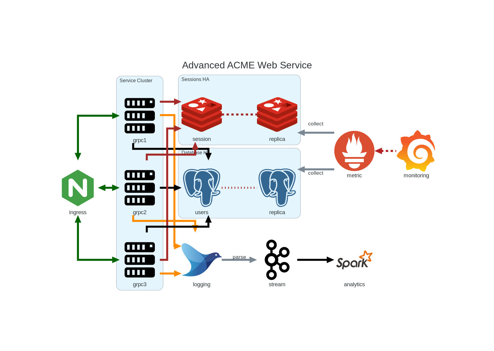

.. create pdf with "rst2pdf EU_STD.rst -s styles/std.yaml,styles/cui.yaml --use-floating-images -o EU_STD.pdf"

.. class:: title-logobox

.. list-table::
   :widths: 72

   * - |
       |
       |
       | |ACME_logo|

|
|
|
|

.. class:: title-deepbox

.. list-table::
   :widths: 72

   * - .. class:: title-name

       Software Version Description
   * - .. class:: title-name

       ACME Engineering Evaluation Unit

|
|
|

.. class:: title-info

Doc #00001043

.. class:: title-info

Version 0.1

.. class:: title-info

01/24/24

|
|
|

.. role:: redtext

.. class:: title-deepbox

.. list-table::
   :widths: 72

   * - .. class:: title-notice

        :redtext:`Example Template Text Only`

        Distribution Statement A: Approved for public release. Distribution is unlimited.

        Controlled by: Department of Good Works, Security and Inspection Division, 800-NOT-REAL.

.. contents:: Table of Contents

.. raw:: pdf

   PageBreak

Revisions
=========

Document revision history.

.. list-table::
   :widths: 9 19 11 33
   :header-rows: 1

   * - Revision
     - Author
     - Date
     - Description
   * - 0.1
     - SLA
     - 2024-01-24
     - Initial draft shell
   * - 0.2
     - SLA
     - 2024-06-15
     - Add example CUI marks and distribution statement

.. raw:: pdf

   PageBreak

1.0 - Scope
===========

1.1 - Identification
~~~~~~~~~~~~~~~~~~~~

This document is the Draft Software Version Description (see revision table)
for the End-user Management Component of the Advanced ACME Web Services Appliance,
Engineering Evaluation Unit.

1.2 - System Overview
~~~~~~~~~~~~~~~~~~~~~

The Advanced ACME Web Services Appliance is an on-premise virtual Web Services
cluster with an advanced management interface.  This document provides both the
Test Description and Test Procedures (steps) for the Management Console only. The
ACME Web Service high-level system components are shown in Figure 1 below:

   Figure 1. Advanced ACME Web Service Components

The management console consumes monitoring data and summarizes/displays the
analytics from Spark.

1.3 - Document Overview
~~~~~~~~~~~~~~~~~~~~~~~

The purpose of this STD is to describe the test preparations, test
cases, and test procedures to be used to perform qualification testing
of the Advanced ACME Web Services Appliance management interface. The
content and format generally follow the STD Data Item Description
(DI-IPSC-81439) but includes only the relevant information for an
engineering evaluation unit.

2.0 Referenced documents
========================

:ACME0081443A: `Software User Manual`_ for the Advanced ACME Web Services Appliance
  Engineering Evaluation Unit, revision 0.0.1, 2023-01-31 [ACME0081443A]_

.. [ACME0081443A]

.. _Software User Manual: https://github.com/VCTLabs/software_user_manual_template/blob/master/sum/EU_SUM.rst

3.0 Test preparations
=====================

This section is divided into the following paragraphs. Safety
precautions, marked by WARNING or CAUTION, and security and privacy
considerations are included where applicable.

3.x (Project-unique identifier of a test)
~~~~~~~~~~~~~~~~~~~~~~~~~~~~~~~~~~~~~~~~~

This paragraph shall identify a test by project-unique identifier,
shall provide a brief description, and shall be divided into the
following subparagraphs. When the information required duplicates
information previously specified for another test, that information may
be referenced rather than repeated.

3.x.1 Hardware preparation
--------------------------

This paragraph shall describe the procedures necessary to prepare the
hardware for the test. Reference may be made to published operating
manuals for these procedures. The following shall be provided, as
applicable:

3.x.2 Software preparation
--------------------------

This paragraph shall describe the procedures necessary to prepare the
item(s) under test and any related software, including data, for the
test. Reference may be made to published software manuals for these
procedures. The following information shall be provided, as applicable:

3.x.3 Other pre-test preparations
---------------------------------

This paragraph shall describe any other pre-test personnel actions,
preparations, or procedures necessary to perform the test.

4.0 Test descriptions
=====================

This section shall be divided into the following paragraphs. Safety
precautions, marked by WARNING or CAUTION, and security and privacy
considerations shall be included as applicable.

4.x (Project-unique identifier of a test)
~~~~~~~~~~~~~~~~~~~~~~~~~~~~~~~~~~~~~~~~~

This paragraph shall identify a test by project-unique identifier and
shall be divided into the following subparagraphs. When the required
information duplicates information previously provided, that
information may be referenced rather than repeated.

4.x.y (Project-unique identifier of a test case)
------------------------------------------------

This paragraph shall identify a test case by project-unique identifier,
state its purpose, and provide a brief description. The following
subparagraphs shall provide a detailed description of the test case.

4.x.y.1 Requirements addressed
##############################

This paragraph shall identify the CSCI or system requirements addressed by
the test case. (Alternatively, this information may be provided in 5.a.)

4.x.y.2 Prerequisite conditions
###############################

This paragraph shall identify any prerequisite conditions that must be
established prior to performing the test case. The following
considerations shall be discussed, as applicable:

a. Hardware and software configuration
b. Flags, initial breakpoints, pointers, control parameters, or initial data to be set/reset prior to test commencement
c. Preset hardware conditions or electrical states necessary to run the test case
d. Initial conditions to be used in making timing measurements
e. Conditioning of the simulated environment
f. Other special conditions peculiar to the test case

4.x.y.3 Test inputs
###################

This paragraph shall describe the test inputs necessary for the test case.
The following shall be provided, as applicable:

a. Name, purpose, and description (e.g., range of values, accuracy) of each test input
b. Source of the test input and the method to be used for selecting the test input
c. Whether the test input is real or simulated
d. Time or event sequence of test input
e. The manner in which the input data will be controlled to:

     1. Test the item(s) with a minimum/reasonable number of data types and values
     2. Exercise the item(s) with a range of valid data types and values that test for overload,
        saturation, and other "worst case" effects
     3. Exercise the item(s) with invalid data types and values to test for appropriate handling
        of irregular inputs
     4. Permit retesting, if necessary

4.x.y.4 Expected test results
#############################

This paragraph shall identify all expected test results for the test case.
Both intermediate and final test results shall be provided, as applicable.

4.x.y.5 Criteria for evaluating results
#######################################

This paragraph shall identify the criteria to be used for evaluating
the intermediate and final results of the test case. For each test
result, the following information shall be provided, as applicable:

4.x.y.6 Test procedure
######################

This paragraph shall define the test procedure for the test case. The
test procedure shall be defined as a series of individually numbered
steps listed sequentially in the order in which the steps are to be
performed. For convenience in document maintenance, the test procedures
may be included as an appendix and referenced in this paragraph. The
appropriate level of detail in each test procedure depends on the type
of software being tested.

For some software, each keystroke may be a separate test procedure
step; for most software, each step may include a logically related
series of keystrokes or other actions. The appropriate level of detail
is the level at which it is useful to specify expected results and
compare them to actual results. The following shall be provided for
each test procedure, as applicable:

4.x.y.7 Assumptions and constraints
###################################

This paragraph shall identify any assumptions made and constraints or
limitations imposed in the description of the test case due to system
or test conditions, such as limitations on timing, interfaces,
equipment, personnel, and database/data files. If waivers or exceptions
to specified limits and parameters are approved, they shall be
identified and this paragraph shall address their effects and impacts
upon the test case.

5.0 Requirements traceability
=============================

Traceability from each test case in this STD to the system or CSCI
requirements it addresses. If a test case addresses multiple
requirements, traceability from each set of test procedure steps to the
requirement(s) addressed. (Alternatively, this traceability may be
provided in 4.x.y.1.).

Traceability from each system or CSCI requirement covered by this STD
to the test case(s) that address it. For CSCI testing, traceability
from each CSCI requirement in the CSCI’s Software Requirements
Specification (SRS) and associated Interface Requirements
Specifications (IRSs). For system testing, traceability from each
system requirement in the system’s System/Subsystem Specification (SSS)
and associated IRSs. If a test case addresses multiple requirements,
the traceability shall indicate the particular test procedure steps
that address each requirement.

6. Notes
========

This section shall contain any general information that aids in
understanding this document (e.g., background information, glossary,
rationale). This section shall include an alphabetical listing of all
acronyms, abbreviations, and their meanings as used in this document
and a list of any terms and definitions needed to understand this
document.

Appendix A. Acronyms and abbreviations
======================================

The following may be used in this document to describe specific technologies
or engineering processes.

:AES: Advanced Encryption Standard - algorithm for symmetric key encryption/decryption
:BIF: Boot Image Format
:CI/CD: Continuous Integration/Continuous Deployment
:CONOPS: Concept of Operations
:COTS: Commercial-Off-The-Shelf
:CSCI: Computer Software Configuration Item
:DT&E: Developmental Test and Evaluation
:FPGA: Field-programmable gate array
:FSBL: First-stage boot loader
:FW: Firmware
:HMAC: Hashed Message Authentication Code - algorithm for private key authentication
:HW: Hardware
:ID: Project-unique identifier
:IRS: Interface Requirements Specification
:ICD: Interface Control Document (should reference IRS docs)
:JTAG: Joint Test Action Group debugging interface
:KPP: Key Performance Parameter
:KSA: Key System Attribute
:LRU: Line-Replaceable Unit
:MOE: Measure of Effectiveness
:MOP: Measure of Performance
:MS: Milestone
:NVM: Nonvolatile Memory
:O&M: Operations and Maintenance
:OCM: On-chip memory
:OT&E: Operational Test and Evaluation
:PL: Programmable Logic - FPGA plus FW
:POR: Power On / Reset
:PS: Processing System - ARMv7 Linux runtime
:PR: Pull Request (agile code review/quality check workflow step)
:R&R: Remove and Replace
:RAM: Reliability, Availability, and Maintainability (aka RMA)
:RC: Release Candidate (SW and FW)
:SS/SRS: System/Subsystem/Software Requirements Specifications
:SS/SDD: System/Subsystem/Software Design Descriptions
:SDP: Software Development Plan
:STP: Software Test Plan
:STD: Software Test Description
:STR: Software Test Report
:SUT: System Under Test
:SW: Software
:T&E: Test and Evaluation
:TDP: Technical Data Package
:VMP: Vulnerability Management Process
